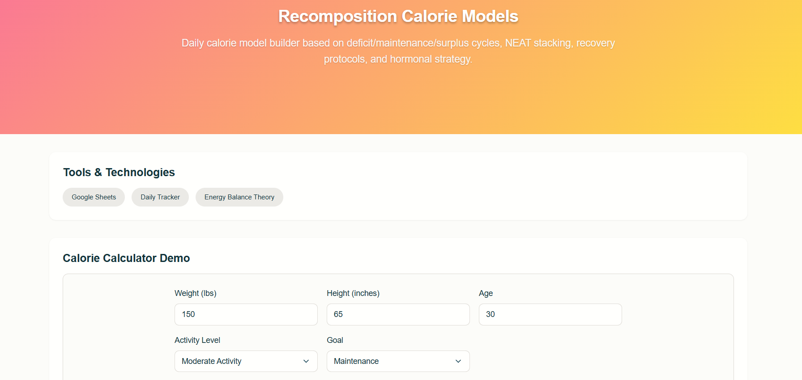
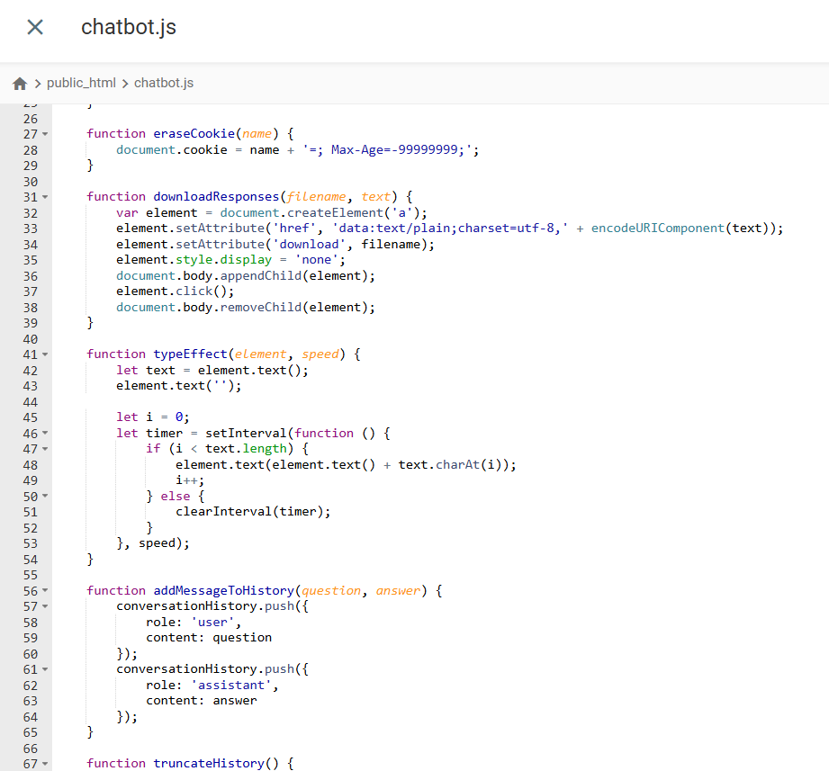

# Dr. David Gramling, PhD  
Director of Data Science & AI | Health-Tech Innovator | Health Practitioner

## 🎬 Watch My Portfolio Welcome Video

*Click the image above to watch my 60-second portfolio overview showcasing AI-powered health solutions and real-world impact.*

PhD-driven leader with 10+ years delivering real-world health-tech impact. I design and deploy scalable, HIPAA-compliant AI systems, advanced analytics, and data-driven wellness protocols—improving patient outcomes, clinician efficiency, and user engagement.

---

## 🌟 AI Portfolio Showcase

  
*At-a-glance dashboard: 10 real-world AI-powered projects covering analytics, automation, and clinical tech solutions.*

---

## 🌐 Live Websites and Demo Portals

- **Live Demo Page:** [10 Real Working AI Demos – View Now](https://sawdatascience.com/10-of-my-real-working-ai-demos-live-and-ready-to-use-on-this-page/)
- **GitHub Pages Demo:** [Portfolio GitHub Demo](https://dgsc23.github.io/data-science-health-ai-portfolio/)
- **Yoga Chatbot (Free Trial):** [Try My Yoga Chatbot](https://chatbot.sawbliss.com/yoga2/mc.html)

---

## 🚀 Complete Project Portfolio & Demos

> **All code and outputs below are demo/pseudocode only. Production code and clinical data are proprietary—contact for secure review or collaboration.**

| Project                                    | Tech Stack                        | Impact / Key Outcome                              | Demo / Code                      |
|---------------------------------------------|-----------------------------------|---------------------------------------------------|-----------------------------------|
| [Azure SQL Migration](#azure-sql-migration)                        | Azure SQL, PowerShell             | Migrated 2M records, saved $500K                  | [Live Demo](https://dgsc23.github.io/data-science-health-ai-portfolio/#project-9) |
| [GPT WordPress Content Generator](#gpt-powered-yoga-content-generator)             | Python, GPT-4, WP API, Pexels     | 5X blog traffic, 100+ posts/month                 | [Live Demo](https://dgsc23.github.io/data-science-health-ai-portfolio/#project-1) |
| [Buffer Score Tracker](#buffer-score-tracker)                       | Python, Google Forms/Sheets       | Prevented burnout for 10+ clients                 | [Live Demo](https://dgsc23.github.io/data-science-health-ai-portfolio/#project-7) |
| [Hypertrophy Clone Model](#hypertrophy-clone-model)                    | Python, Pandas                    | 15% outcome improvement, 5,000+ tracked sessions  | [Live Demo](https://dgsc23.github.io/data-science-health-ai-portfolio/#project-6) |
| [Live Code Playground](#live-code-playground)                       | HTML, JS, CodeMirror              | 1,000+ learners                                   | [Demo & Code](#live-code-playground) |
| [Social Media Sponsor System](#social-media-sponsor-review-system)                | Airtable, Google Sheets           | 100% positive review/ROI tracking                 | [Live Demo](https://dgsc23.github.io/data-science-health-ai-portfolio/#project-2) |
| [Massage Session Data Map](#massage-session-data-map)                   | HTML, JS, PEMF/BioMat             | Standardized 1,000+ therapy sessions              | [Live Demo](https://dgsc23.github.io/data-science-health-ai-portfolio/#project-3) |
| [Yoga Stress Reduction Analysis](#yoga-stress-reduction-analysis)             | NVivo, Statistical Scales         | Informed medical curricula                        | [Live Demo](https://dgsc23.github.io/data-science-health-ai-portfolio/#project-4) |
| [Recomposition Calorie/Buffer Models](#recomposition-calorie-models)        | Python, Google Sheets             | Used for 400+ days, 1,000+ tracked daily entries  | [Live Demo](https://dgsc23.github.io/data-science-health-ai-portfolio/#project-5) |
| [Azure ML Data Visuals](#azure-ml-data-visuals)                      | Azure ML Studio, Python, Plotly   | Visualized 2M+ rows, clinical analytics           | [Live Demo](https://dgsc23.github.io/data-science-health-ai-portfolio/#project-8) |
| [Calorie Tracker URL Automation](#calorie-tracker-url-automation)             | Python, Google Forms API          | Streamlined logging for 100+ users                | [Live Demo](https://dgsc23.github.io/data-science-health-ai-portfolio/#project-10) |
| Social Media Growth Predictor              | Python, Scikit-learn              | Predicted 20%+ channel growth                     | [Code](https://github.com/Dgsc23/social-media-analytics-project) |
| [Yoga Chatbot (Free Trial Version)](#yoga-chatbot-free-trial-version)          | HTML, JS, GPT-4                   | Used for pain patients, featured by influencers   | [Try Free](https://chatbot.sawbliss.com/yoga2/mc.html)            |

*Full portfolio and more details: [dgsc23.site/Dgsc23/data-science-health-ai-project/](https://dgsc23.site/Dgsc23/data-science-health-ai-project/)*

---

## 🖼️ Project Screenshots & Visuals

### Azure SQL Migration (HIPAA-Secure)
  
*Live monitoring of a secure, HIPAA-compliant patient data migration to Azure SQL with full encryption and remote access support.*

🔗 **[View Interactive Demo](https://dgsc23.github.io/data-science-health-ai-portfolio/#project-9)**

---

### GPT-Powered Yoga Content Generator
  
*End-to-end AI content pipeline: generate, enhance, and publish yoga blog content with GPT-4 and Pexels API direct to WordPress.*

🔗 **[View Interactive Demo](https://dgsc23.github.io/data-science-health-ai-portfolio/#project-1)**

---

### Buffer Score Tracker
  
*Automated tracker for subjective wellness, readiness, and fatigue scores, supporting real-time decision making for clients and clinics.*

🔗 **[View Interactive Demo](https://dgsc23.github.io/data-science-health-ai-portfolio/#project-7)**

---

### Hypertrophy Clone Model
  
*Simulate muscle gain across three body types using comparative modeling—track hypertrophy, metabolism, and hormonal factors.*

🔗 **[View Interactive Demo](https://dgsc23.github.io/data-science-health-ai-portfolio/#project-6)**

---

### Live Code Playground
  
*Interactive Live Code Playground—users can instantly write, preview, and export HTML, CSS, and JavaScript code with real-time feedback.*

🔗 **[View Interactive Demo](https://sawdatascience.com/live-code-playground-write-preview-and-export-your-code/)**

---

### Social Media Sponsor Review System
  
*Sponsor review automation for influencer campaigns—track reviews, blind testers, product rotation, and ROI analytics in Airtable.*

🔗 **[View Interactive Demo](https://dgsc23.github.io/data-science-health-ai-portfolio/#project-2)**

---

### Massage Session Data Map
  
*Interactive protocol mapping for 1,000+ massage sessions—integrates BioMat, PEMF, essential oils, and assisted stretching.*

🔗 **[View Interactive Demo](https://dgsc23.github.io/data-science-health-ai-portfolio/#project-3)**

---

### Yoga Stress Reduction Analysis
  
*Dissertation-backed stress reduction analytics using NVivo and structured interviews—impacting medical education and curriculum.*

🔗 **[View Interactive Demo](https://dgsc23.github.io/data-science-health-ai-portfolio/#project-4)**

---

### Recomposition Calorie Models
  
*Custom calorie calculator for daily deficit, maintenance, and surplus cycles, integrating NEAT, recovery, and hormonal strategies.*

🔗 **[View Interactive Demo](https://dgsc23.github.io/data-science-health-ai-portfolio/#project-5)**

---

### Azure ML Data Visuals
  
*Medical data visualizations built in Azure ML Studio—line, bar, and overlay plots for clinical and lifestyle analytics.*

🔗 **[View Interactive Demo](https://dgsc23.github.io/data-science-health-ai-portfolio/#project-8)**

---

### Calorie Tracker URL Automation
  
*Python-powered automation for logging 24 lifestyle fields in Google Forms—including calories, sleep, hydration, and activity—in one click.*

🔗 **[View Interactive Demo](https://dgsc23.github.io/data-science-health-ai-portfolio/#project-10)**

---

## 🧩 Notable Side Projects & Technical Components

#### Custom Chatbot JavaScript (main.js)
  
*Excerpt from the core JavaScript (main.js) powering the custom GPT-based chatbot app, supporting dynamic model selection and user API entry.*

#### Custom Chatbot Full App Demo
  
*End-to-end workflow of the custom GPT chatbot creator, from setup to user response history and testimonials.*

#### Live Code Playground Export Functions
  
*JavaScript logic for the Live Code Playground, enabling users to preview and download HTML, CSS, and JS exports on demand.*

#### YouTube Timestamps Code (Python)
  
*Key Python functions for generating YouTube transcript-based timestamps, custom summaries, and duration calculations.*

#### YouTube Transcript Timestamp Demo
  
*Output example: generated timestamps and chapter markers for a full YouTube video transcript.*

#### Yin Yoga Chatbot (Glamorous Theme)
  
*Custom UI for the Yin Yoga Chatbot using a "Glamorous" color scheme and full ChatGPT API support.*

#### Yin Yoga Chatbot (Default Theme)
  
*Yin Yoga Chatbot with a clean default color scheme, showing model and word count options, and a typical chatbot response.*

#### Chatbot App Key Functions (chatbot.js)
  
*Key JavaScript functions for chatbot response download, typing effect, and message history handling.*

#### Chatbot Custom Creator Demo
  
*Interactive UI for building a fully custom chatbot, including email login, theme selection, and design personalization.*

---

## 💡 Skills & Specialties

- **Languages:** Python, SQL, JavaScript, HTML/CSS
- **Cloud & Data:** Azure (SQL, ML Studio, Key Vault), PowerShell, Pandas
- **AI & Analytics:** GPT-4, OpenAI, scikit-learn, NVivo, Tableau, Airtable, Google Sheets/Forms
- **Web/Automation:** WordPress API, REST APIs, Git, Chrome Extensions
- **Compliance:** HIPAA, enterprise security, health analytics

---

## 📈 Impact & Leadership

- **Built & Deployed:** 12+ live demos and apps for health-tech, wellness, and automation
- **Data Migration:** HIPAA-compliant migration of 2M patient records, $500K+ operational savings
- **Patient Outcomes:** Tracked 5,000+ clinical sessions; improved outcomes by 15%
- **Automated Analytics:** Buffer score/calorie models used >400 days; tracked 1,000+ daily entries
- **Content Automation:** 5X increase in blog traffic, 100+ posts/month with AI
- **Education & Influence:** 100+ students (high school, yoga), 1,000+ learners via code playground
- **Social Media Reach:** 80K+ YouTube subs (across channels), 130K+ Instagram followers, Amazon Platinum Influencer
- **Clinical Practice:** 5,000+ hours functional restoration, 15+ patients/week at East Highland Chiro, 4–6 hours/day hands-on

---

## 🏆 Achievements

- PhD in Education (Leadership in Higher Ed), ERYT-500, Integrative Health Practitioner
- HIPAA compliance, Azure/AWS data engineering, Python automation
- Amazon Influencer & monetized YouTube (6 channels, 200+ videos)
- Multiple proprietary protocols: The Strength BioBuild Somatic System™

---

## 🌐 Links & Contact

- **Portfolio & Demos:** [dgsc23.site/Dgsc23/data-science-health-ai-project/](https://dgsc23.site/Dgsc23/data-science-health-ai-project/)
- **Website:** [sawdatascience.com](https://sawdatascience.com)
- **GitHub Pages Demo:** [Portfolio GitHub Demo](https://dgsc23.github.io/data-science-health-ai-portfolio/)
- **Yoga Chatbot Free Trial:** [chatbot.sawbliss.com/yoga2/mc.html](https://chatbot.sawbliss.com/yoga2/mc.html)
- **Code Playground:** [Live Demo & Code](https://sawdatascience.com/live-code-playground-write-preview-and-export-your-code/)
- **Book a Session:** [Get Started](https://sawdatascience.com/get-started-on-your-data-driven-journey-book-an-appointment-with-dr-david-gramling-ph-d/)
- **LinkedIn:** [linkedin.com/in/davidgramlingphd](https://linkedin.com/in/davidgramlingphd)
- **Instagram:** [@dryogatips](https://instagram.com/dryogatips)
- **YouTube:** [Yoga Tips](https://www.youtube.com/@yogatips)
- **Amazon Storefront:** [Best Home Products](https://www.amazon.com/shop/sawyogacourses)
- **(Business email available upon request)**

---

**Let's connect!**  
If you're interested in innovative, AI-powered health-tech solutions, wellness analytics, or executive consulting, explore my demos or [book a 1:1 session](https://sawdatascience.com/get-started-on-your-data-driven-journey-book-an-appointment-with-dr-david-gramling-ph-d/).

---

<!-- Screenshots, code snippets, and visuals integrated above. For extra visuals, see subfolder READMEs or request a secure code review. -->
