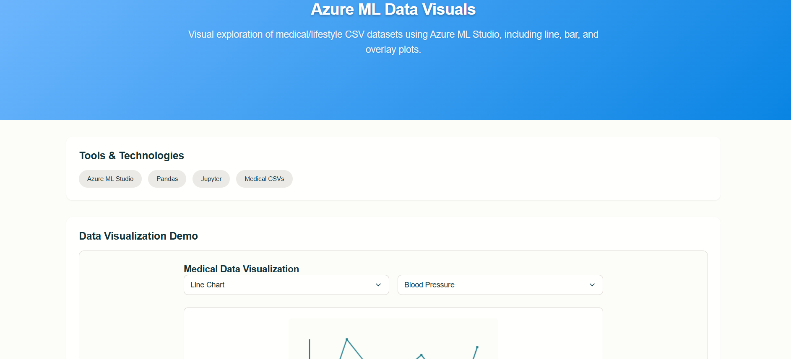

# Azure ML Data Visuals Demo

Processes and visualizes large-scale clinical and wellness datasets on Azure ML and Python.  
Supports outcome tracking and reporting for over 2 million medical records.

