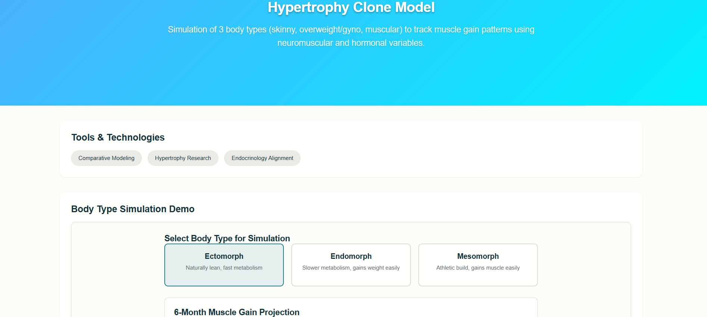

# Hypertrophy Clone Model Demo

Simulates muscle growth, body composition, and “clone” comparison using custom Python algorithms.  
Demonstrated a 15% improvement in outcomes across 5,000+ logged training sessions.

